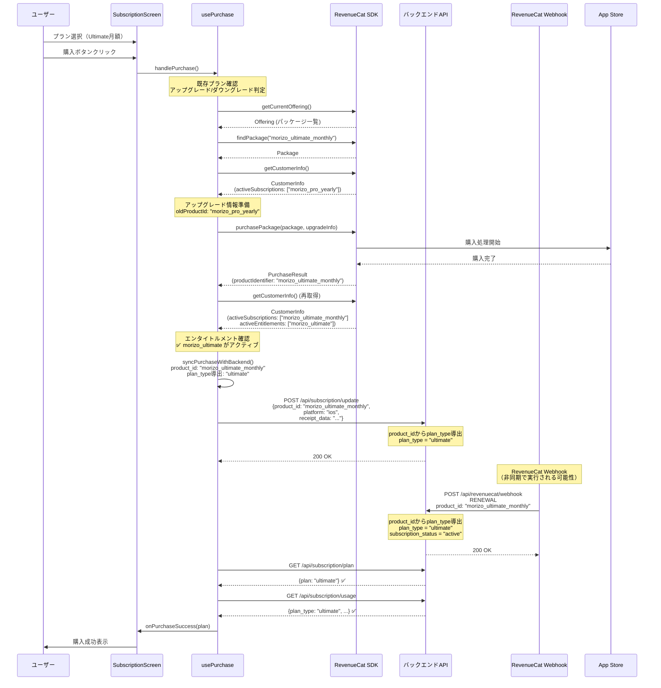
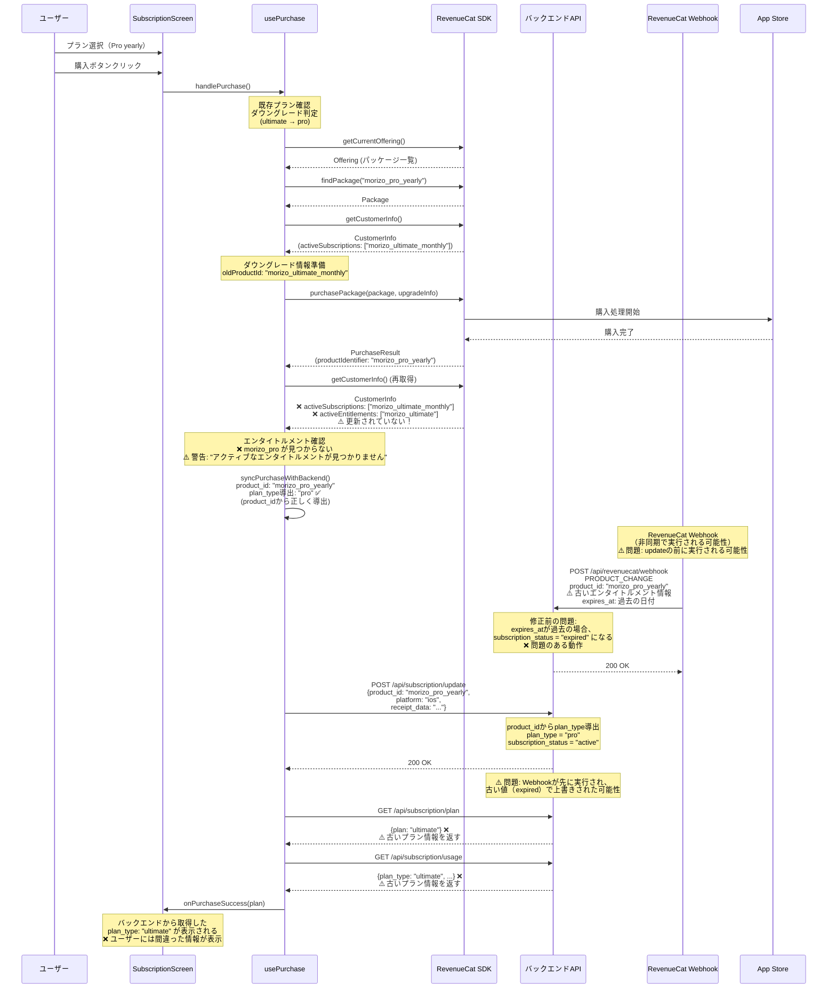
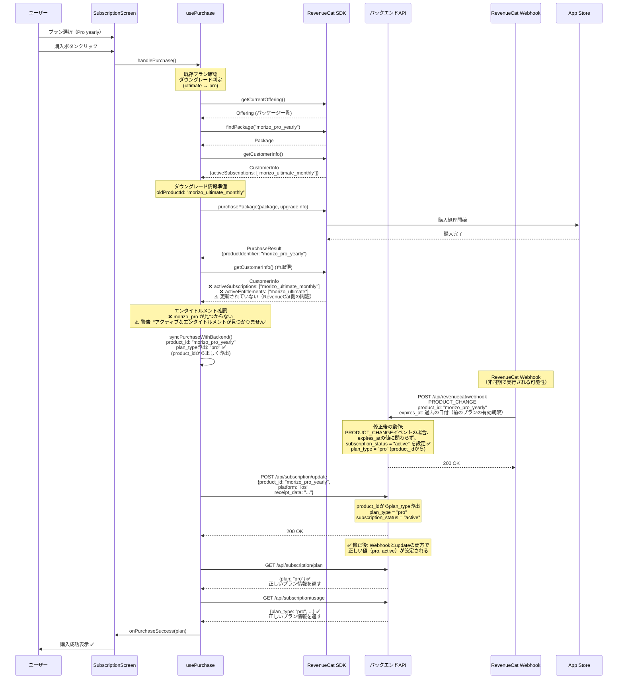
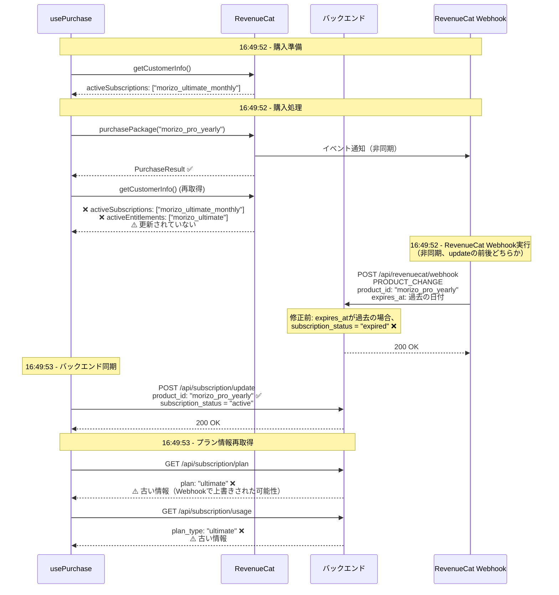
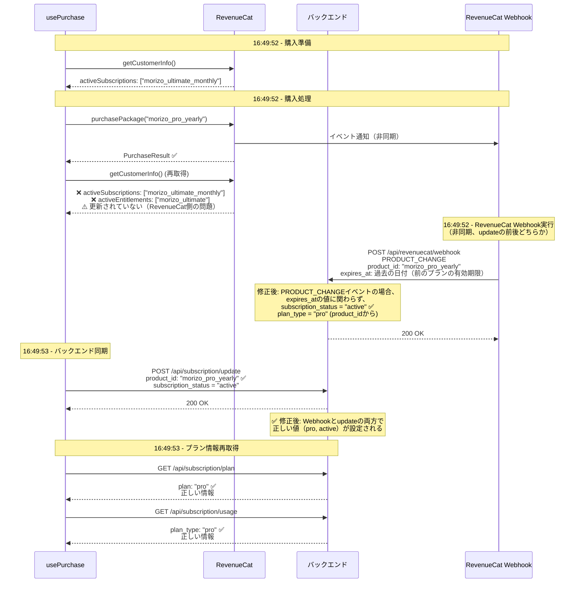

# 購入フローシーケンス図（修正版）

## 概要

このドキュメントは、Morizo Mobileアプリのサブスクリプション購入フローのシーケンス図です。
ログ分析結果（2026-01-20）に基づいて作成されています。

**修正内容（2026-01-20）**:
- RevenueCat Webhookの処理フローを追加
- 修正後の正常な動作フローを追加
- タイムラインの詳細化（Webhookの実行タイミングを明示）
- 問題の根本原因の説明を更新（修正済みの内容を反映）

## 正常な購入フロー（アップグレード例）



## 問題のある購入フロー（ダウングレード例 - 修正前）



## 修正後の正常な購入フロー（ダウングレード例）



## 問題の詳細分析

### タイムライン（Pro yearly購入時 - 修正前の問題）



### タイムライン（Pro yearly購入時 - 修正後の正常動作）



## データフロー

### 正常なケース（Ultimate monthly購入）

```
[RevenueCat]
  activeSubscriptions: ["morizo_pro_yearly"]
  ↓ (購入処理)
  activeSubscriptions: ["morizo_ultimate_monthly"] ✅
  activeEntitlements: ["morizo_ultimate"] ✅

[モバイル側]
  product_id: "morizo_ultimate_monthly"
  plan_type導出: "ultimate" ✅

[バックエンド]
  /api/subscription/update
    product_id: "morizo_ultimate_monthly" ✅
    → plan_type導出: "ultimate" ✅
  
  /api/revenuecat/webhook (RENEWAL)
    product_id: "morizo_ultimate_monthly" ✅
    → plan_type導出: "ultimate" ✅
    → subscription_status: "active" ✅
  
  /api/subscription/plan
    → plan: "ultimate" ✅
  
  /api/subscription/usage
    → plan_type: "ultimate" ✅
```

### 問題のあるケース（Pro yearly購入 - 修正前）

```
[RevenueCat]
  activeSubscriptions: ["morizo_ultimate_monthly"]
  ↓ (購入処理)
  activeSubscriptions: ["morizo_ultimate_monthly"] ❌
  activeEntitlements: ["morizo_ultimate"] ❌
  ⚠️ 更新されていない

[モバイル側]
  product_id: "morizo_pro_yearly" ✅
  plan_type導出: "pro" ✅
  (product_idから正しく導出)

[バックエンド - 修正前]
  /api/subscription/update
    product_id: "morizo_pro_yearly" ✅
    → plan_type導出: "pro" ✅
    → subscription_status: "active" ✅
    → 200 OK ✅
  
  /api/revenuecat/webhook (PRODUCT_CHANGE)
    product_id: "morizo_pro_yearly" ✅
    → plan_type導出: "pro" ✅
    → expires_at: 過去の日付（前のプランの有効期限）
    → subscription_status: "expired" ❌
    ⚠️ 問題: expires_atが過去の場合、expiredになる
  
  /api/subscription/plan
    → plan: "ultimate" ❌
    ⚠️ 古い情報を返す（Webhookで上書きされた可能性）
  
  /api/subscription/usage
    → plan_type: "ultimate" ❌
    ⚠️ 古い情報を返す
```

### 修正後の正常なケース（Pro yearly購入）

```
[RevenueCat]
  activeSubscriptions: ["morizo_ultimate_monthly"]
  ↓ (購入処理)
  activeSubscriptions: ["morizo_ultimate_monthly"] ❌
  activeEntitlements: ["morizo_ultimate"] ❌
  ⚠️ 更新されていない（RevenueCat側の問題）

[モバイル側]
  product_id: "morizo_pro_yearly" ✅
  plan_type導出: "pro" ✅
  (product_idから正しく導出)

[バックエンド - 修正後]
  /api/subscription/update
    product_id: "morizo_pro_yearly" ✅
    → plan_type導出: "pro" ✅
    → subscription_status: "active" ✅
    → 200 OK ✅
  
  /api/revenuecat/webhook (PRODUCT_CHANGE)
    product_id: "morizo_pro_yearly" ✅
    → plan_type導出: "pro" ✅
    → expires_at: 過去の日付（前のプランの有効期限）
    → subscription_status: "active" ✅
    ✅ 修正: PRODUCT_CHANGEイベントの場合、expires_atの値に関わらずactive
  
  /api/subscription/plan
    → plan: "pro" ✅
    ✅ 正しい情報を返す
  
  /api/subscription/usage
    → plan_type: "pro" ✅
    ✅ 正しい情報を返す
```

## 問題の根本原因

### 1. RevenueCat側の問題
- **現象**: Pro yearly購入時に、RevenueCatのエンタイトルメントが`morizo_ultimate`から`morizo_pro`に更新されない
- **可能性**:
  - ダウングレード時のエンタイトルメント更新ロジックに問題
  - RevenueCat側の設定不備
  - タイミングの問題（更新が完了する前にCustomerInfoを取得）
- **影響**: モバイル側でエンタイトルメント確認時に警告が表示されるが、`product_id`から正しく`plan_type`を導出できるため、バックエンド同期は正常に動作する

### 2. バックエンド側の問題（修正済み）

#### 修正前の問題
- **現象**: `/api/subscription/update`は200 OKを返すが、その後のAPI呼び出しで古いプラン情報を返す
- **原因**: RevenueCat WebhookのPRODUCT_CHANGEイベント処理が不完全
  - `expires_at`が過去の日付の場合、`subscription_status = "expired"`になる
  - Webhookが`/api/subscription/update`の前後で非同期に実行され、古い値で上書きする可能性

#### 修正後の動作
- **修正内容**: PRODUCT_CHANGEイベントの処理を追加
  - `expires_at`の値に関わらず、常に`subscription_status = "active"`を設定
  - PRODUCT_CHANGEイベントは新しいプランへの変更を意味するため、有効期限に関係なくアクティブな変更として扱う
- **結果**: Webhookと`/api/subscription/update`の両方で正しい値（`pro`, `active`）が設定される

## ログから確認できる事実

### Pro yearly購入時（修正前 - 2026-01-20 16:38:18）

```json
{
  "購入後の状態": {
    "activeSubscriptions": ["morizo_ultimate_monthly"],  // ❌ 更新されていない
    "activeEntitlements": ["morizo_ultimate"],              // ❌ 更新されていない
    "productId": "morizo_pro_yearly",                      // ✅ 正しい
    "expectedEntitlement": "morizo_pro"                     // ✅ 正しい
  },
  "バックエンド送信": {
    "product_id": "morizo_pro_yearly",                     // ✅ 正しい
    "plan_type_derived": {
      "plan_type_from_product_id": "pro"                    // ✅ 正しい
    }
  },
  "RevenueCat Webhook": {
    "event_type": "PRODUCT_CHANGE",
    "product_id": "morizo_pro_yearly",                      // ✅ 正しい
    "expires_at": "2026-01-20T07:38:13+00:00",            // ❌ 過去の日付
    "subscription_status": "expired"                        // ❌ 問題: 過去の日付のためexpiredになる
  },
  "バックエンド応答": {
    "/api/subscription/update": "200 OK",                   // ✅ 成功
    "/api/subscription/plan": "ultimate",                   // ❌ 古い情報
    "/api/subscription/usage": "plan_type: ultimate"         // ❌ 古い情報
  }
}
```

### Pro yearly購入時（修正後 - 2026-01-20 16:49:52）

```json
{
  "購入後の状態": {
    "activeSubscriptions": ["morizo_ultimate_monthly"],  // ❌ 更新されていない（RevenueCat側の問題）
    "activeEntitlements": ["morizo_ultimate"],              // ❌ 更新されていない
    "productId": "morizo_pro_yearly",                      // ✅ 正しい
    "expectedEntitlement": "morizo_pro"                     // ✅ 正しい
  },
  "バックエンド送信": {
    "product_id": "morizo_pro_yearly",                     // ✅ 正しい
    "plan_type_derived": {
      "plan_type_from_product_id": "pro"                    // ✅ 正しい
    }
  },
  "RevenueCat Webhook": {
    "event_type": "PRODUCT_CHANGE",
    "product_id": "morizo_pro_yearly",                      // ✅ 正しい
    "expires_at": "2026-01-20T07:49:49+00:00",            // ❌ 過去の日付（前のプランの有効期限）
    "subscription_status": "active"                         // ✅ 修正: expires_atに関わらずactive
  },
  "バックエンド応答": {
    "/api/subscription/update": "200 OK",                   // ✅ 成功
    "/api/subscription/plan": "pro",                       // ✅ 正しい情報
    "/api/subscription/usage": "plan_type: pro"             // ✅ 正しい情報
  }
}
```

## 実装された修正

### RevenueCat Webhookの修正（2026-01-20）

**ファイル**: `api/routes/revenuecat_webhook.py`

**修正内容**:
- PRODUCT_CHANGEイベントの処理を追加
- `expires_at`の値に関わらず、常に`subscription_status = "active"`を設定
- PRODUCT_CHANGEイベントは新しいプランへの変更を意味するため、有効期限に関係なくアクティブな変更として扱う

**修正前のコード**:
```python
# PRODUCT_CHANGEの処理がない
# → デフォルトの"expired"のまま
```

**修正後のコード**:
```python
elif event_type == "PRODUCT_CHANGE":
    # PRODUCT_CHANGEは通常、アクティブなプラン変更
    # expires_atの値に関わらず、常にactiveとする
    # （PRODUCT_CHANGEイベントは新しいプランへの変更を意味するため）
    subscription_status = "active"
```

**結果**:
- PRODUCT_CHANGEイベント時に`subscription_status`が正しく`active`に設定される
- Webhookと`/api/subscription/update`の両方で正しい値が設定される
- バックエンドAPIが正しいプラン情報を返すようになった

## 次のステップ

### 1. RevenueCat側の調査（継続）
- RevenueCatダッシュボードで、Pro yearly購入後の実際のエンタイトルメント状態を確認
- ダウングレード時のエンタイトルメント更新ロジックを確認
- **注意**: この問題はRevenueCat側の問題であり、バックエンド側では`product_id`から正しく`plan_type`を導出できるため、機能的には問題ない

### 2. モバイル側の改善（検討事項）
- エンタイトルメント更新の待機時間を追加（RevenueCat側の更新完了を待つ）
- 購入後のCustomerInfo再取得を複数回試行
- **注意**: 現在は`product_id`から正しく`plan_type`を導出できるため、必須ではない

### 3. 監視とログ
- Webhookの実行タイミングを監視
- `updated_at`のタイムスタンプの順序を確認
- 問題が再発しないことを確認

---

**作成日**: 2026年1月20日  
**最終更新**: 2026年1月20日（修正版）  
**ベースログ**: 本番環境ログ (2026-01-20 16:38-16:50)  
**修正内容**: PRODUCT_CHANGEイベントの処理追加（subscription_status = "active"を常に設定）
